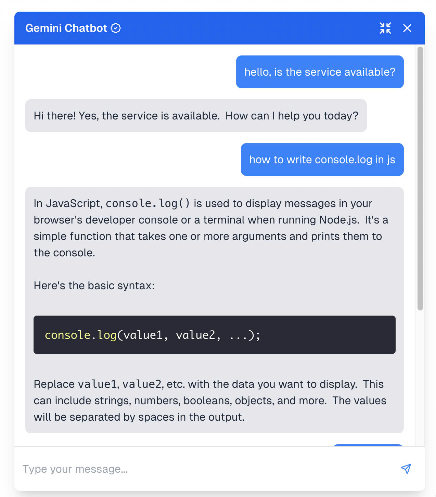
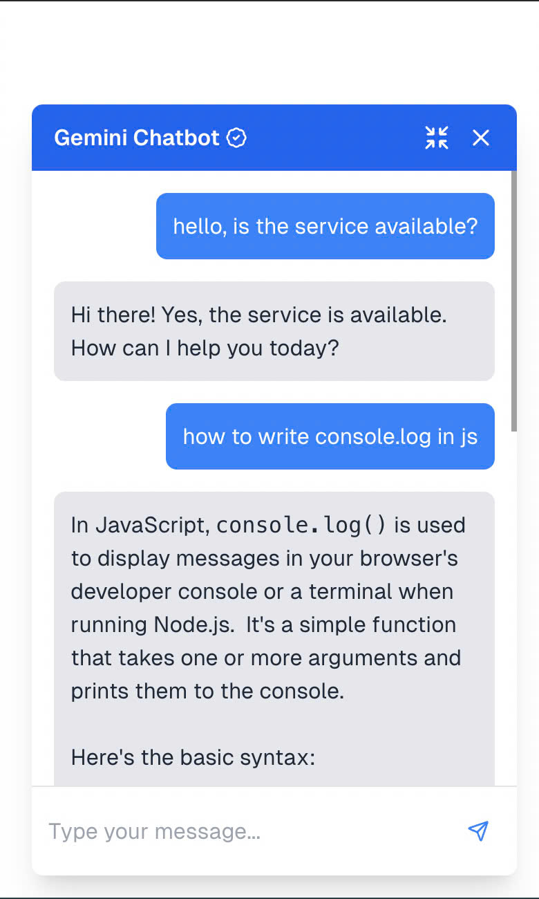

# Gemini Chatbot

- This project is a full-stack chatbot application with a **Next.js** frontend and **Express.js** backend.
- The chatbot integrates with Google's Gemini API (free-tier) to generate responses based on user input.
- The system also stores conversation messages and maintains session context during interactions.

## Features

- **Message Storage & Retrieval**: Stores user and chatbot messages, allowing for persistent conversation history that can be loaded and resumed during future interactions.
- **Message History for Context**: Sends the conversation history to the chatbot model, allowing it to consider previous messages and improve the quality and relevance of its responses.
- **Gemini Message Stream**: Utilizes the Gemini Message Stream to efficiently process and display large responses.
- **Chunked Responses**: Displays Gemini API responses chunk by chunk, improving load times and providing a faster, smoother experience.
- **Responsive Design**: Seamlessly adapts to both desktop and mobile devices for a consistent user experience.
- **Resizable Chat Window**: Users can expand or shrink the chat window to suit their preferences.
- **Code Syntax Highlighting**: Supports displaying code snippets with proper syntax highlighting for better readability.
- **Smooth Animations**: Enhances user interaction with subtle animations, providing a more dynamic and engaging experience.

## Screenshots

<p align="center">
  
  
</p>

## Gemini Model
- **gemini-1.5-flash**: The version of the Gemini model used to generate responses.

## Tech Stack

### Frontend
- Next.js
- Shadcn/ui

### Backend
- Express.js
- Mongoose

### Database
- MongoDB

### Deployment
- **Frontend**: Vercel
- **Backend**: Render

## Getting Started

### Prerequisites

- Node.js (v18.x)
- npm (v9.x)
- Gemini API key (instructions below)

### Setting up the Backend (Express.js)

1. Navigate to the `/backend` folder:

    ```bash
    cd backend
    ```

2. Install dependencies:

    ```bash
    npm install
    ```

3. Create a `.env` file in the `/backend` folder to store your environment variables. Add your Gemini API key and MongoDB URI:

    ```env
    PORT=8000
    GEMINI_API_KEY=your-gemini-api-key
    MONGO_URI=your-mongo-uri
    ```

4. Start the Express.js server:

    ```bash
    npm run dev
    ```

   The backend server will be running at `http://localhost:${PORT}`.

### Setting up the Frontend (Next.js)

1. Navigate to the `/frontend` folder:

    ```bash
    cd frontend
    ```

2. Install dependencies:

    ```bash
    npm install
    ```

3. Create a `.env.local` file in the `/frontend` folder for environment variables. Add the backend URL:

    ```env
    NEXT_PUBLIC_BACKEND_URL=http://localhost:${PORT}
    ```

4. Start the Next.js server:

    ```bash
    npm run dev
    ```

   The frontend will be running at `http://localhost:3000`.

### Getting the Gemini API Key

To get a Gemini API key, follow these steps:

1. Visit the [Gemini API Documentation](https://gemini.com/api) and sign up for an account if you haven't already.
2. Once logged in, go to your [API Settings](https://gemini.com/account/settings/api).
3. Create a new API key and secret.
4. Copy the API key and secret into the `.env` file for the backend (as described above).

### Running the Project

Once both the frontend and backend are set up and running, visit the frontend in your browser at `http://localhost:3000` to interact with the chatbot. The chatbot will communicate with the backend, which in turn will call the Gemini API to generate responses.

### Database Structure

The project uses MongoDB to store the following data:

- **Users**: Stores user details such as name and session information.
- **Threads**: Contains conversation threads associated with each user.
- **Messages**: Stores messages within threads, keeping track of both user inputs and chatbot responses.

This structure ensures that conversations are saved and can be accessed for session continuity.
